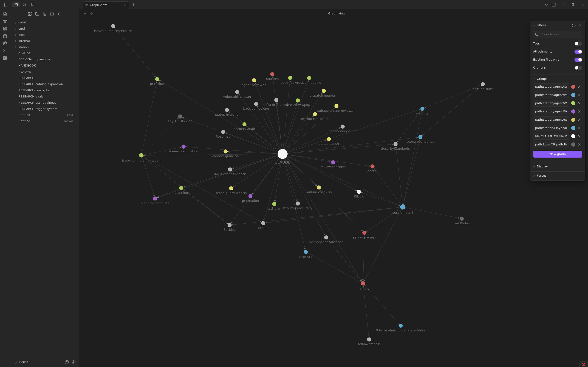

<div align="center">

# Bonsai

**A structured language for working with AI agents.**

[](https://github.com/LastStep/Bonsai/releases)
[](LICENSE)
[](https://github.com/LastStep/Bonsai/actions?query=workflow%3ACI)
[](https://laststep.github.io/Bonsai/)

Give your Claude Code agents identity, memory, protocols, and purpose —<br>
so they work like teammates, not tools.

[Documentation](https://laststep.github.io/Bonsai/) · [Install](#install) · [Quick Start](#quick-start) · [Contributing](CONTRIBUTING.md)

<br>



<sub>A Bonsai workspace visualized in Obsidian — every node is a generated file, every edge is a live cross-reference.</sub>

</div>

<br>

---

## Why Bonsai

Claude Code is powerful out of the box. But the moment you need agents to **coordinate**, **stay consistent across sessions**, or **follow your team's standards** — you're writing walls of markdown by hand.

Bonsai treats agent instructions as a **structured language** — a layered system where each layer has clear semantics:

```
  Layer 6 │ Sensors       │ Automated enforcement via Claude Code hooks
  Layer 5 │ Routines      │ Periodic self-maintenance on a schedule
  Layer 4 │ Skills        │ Domain knowledge — standards, patterns, conventions
  Layer 3 │ Workflows     │ Step-by-step procedures — planning, review, audit
  Layer 2 │ Protocols     │ Hard rules — security, scope, memory, startup
  Layer 1 │ Core          │ Identity, memory, self-awareness
```

You pick the components. Bonsai generates a complete, wired-up workspace — cross-linked navigation, auto-enforced hooks, and a shared project scaffold that keeps every agent on the same page.

One binary. No runtime. Works with any project.

---

## Install

**Homebrew:**

```bash
brew install LastStep/tap/bonsai
```

**Binary download** — [GitHub Releases](https://github.com/LastStep/Bonsai/releases):

```bash
curl -sL https://github.com/LastStep/Bonsai/releases/latest/download/bonsai_Linux_amd64.tar.gz | tar xz
sudo mv bonsai /usr/local/bin/
```

**From source** (Go 1.24+):

```bash
go install github.com/LastStep/Bonsai/cmd/bonsai@latest
```

---

## Quick Start

```bash
cd your-project
bonsai init          # set up station + Tech Lead agent
bonsai add           # add a code agent (backend, frontend, etc.)
```

Your project now has a full agent workspace. Open it in Claude Code and say "hi, get started" — the agent self-orients, reads its identity, checks memory, and reports status.

> **[Your First Workspace](https://laststep.github.io/Bonsai/guides/your-first-workspace/)** — full walkthrough with screenshots and explanations.

---

## What's Inside

### Six Agent Types

| Agent | Role |
|:------|:-----|
| **Tech Lead** | Architects, plans, reviews — never writes application code |
| **Backend** | API, database, server-side logic |
| **Frontend** | UI components, state management, styling |
| **Full-Stack** | End-to-end — UI, API, database, auth, tests |
| **DevOps** | Infrastructure-as-code, CI/CD, containers |
| **Security** | Vulnerability audits, auth review, dependency scanning |

The Tech Lead orchestrates. Code agents implement. You talk to the Tech Lead — it writes plans, dispatches work via worktree-isolated subagents, and reviews the output.

### The Catalog

Bonsai ships with **58 catalog items** — all mix-and-match, filtered by agent compatibility:

- **17 skills** — coding standards, API design, auth patterns, testing, infrastructure conventions
- **10 workflows** — planning, code review, security audit, PR review, session logging
- **4 protocols** — memory, security, scope boundaries, session startup (all required)
- **12 sensors** — scope guards, dispatch validation, context injection, code quality checks
- **8 routines** — backlog hygiene, dependency audit, doc freshness, vulnerability scan

> **[Browse the full catalog](https://laststep.github.io/Bonsai/catalog/overview/)** with descriptions, compatibility tables, and default configurations.

### Extensible by Design

After generation, you own the files. Add custom skills, workflows, or sensors — run `bonsai update` and Bonsai detects them, tracks them in your config, and includes them in navigation. Lock-aware conflict resolution means your edits are never silently overwritten.

> **[Customizing Abilities](https://laststep.github.io/Bonsai/guides/customizing-abilities/)** · **[Creating Custom Sensors](https://laststep.github.io/Bonsai/guides/creating-custom-sensors/)** · **[Creating Custom Routines](https://laststep.github.io/Bonsai/guides/creating-custom-routines/)**

---

## Commands

| Command | What it does |
|:--------|:------------|
| `bonsai init` | Initialize project — station, scaffolding, Tech Lead |
| `bonsai add` | Add a code agent or abilities to an existing agent |
| `bonsai remove` | Remove an agent or individual ability |
| `bonsai list` | Show installed agents and components |
| `bonsai catalog` | Browse all available abilities |
| `bonsai update` | Detect custom files, sync workspace |
| `bonsai guide` | Render the custom files guide in terminal |

> **[Command Reference](https://laststep.github.io/Bonsai/commands/init/)** — full documentation with flags, interactive flows, and examples.

---

## Documentation

The full documentation is at **[laststep.github.io/Bonsai](https://laststep.github.io/Bonsai/)**:

- **[Concepts](https://laststep.github.io/Bonsai/concepts/how-bonsai-works/)** — how Bonsai works, agents, abilities, sensors, routines, scaffolding
- **[Guides](https://laststep.github.io/Bonsai/guides/your-first-workspace/)** — tutorials and how-tos
- **[Catalog](https://laststep.github.io/Bonsai/catalog/overview/)** — browse all agents, skills, workflows, protocols, sensors, routines
- **[Reference](https://laststep.github.io/Bonsai/reference/configuration/)** — configuration schemas, template variables, glossary

---

## Contributing

Bonsai is early-stage and evolving fast. See [CONTRIBUTING.md](CONTRIBUTING.md) for setup, conventions, and PR guidelines.

---

<div align="center">

**[Documentation](https://laststep.github.io/Bonsai/)** · **[Releases](https://github.com/LastStep/Bonsai/releases)** · **[MIT License](LICENSE)**

Built with [Cobra](https://github.com/spf13/cobra), [Huh](https://github.com/charmbracelet/huh), [LipGloss](https://github.com/charmbracelet/lipgloss), and [BubbleTea](https://github.com/charmbracelet/bubbletea).<br>
Developed with [Claude Code](https://claude.ai/code).

</div>
